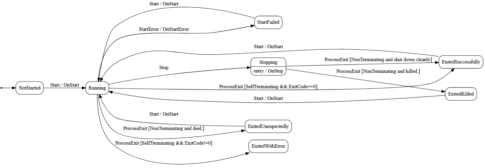

# Little Forker

[](https://github.com/damianh/LittleForker/actions?query=workflow%3Aci)
[](https://www.nuget.org/packages/LittleForker)

A utility to aid in the launching and supervision of processes. The original use
case is installing a single service who then spawns other processes as part of a
multi-process application.

## Features

  1. **ProcessExitedHelper**: a helper around `Process.Exited` with some additional
     logging and event raising if the process has already exited or not found.

  2. **ProcessSupervisor**: allows a parent process to launch a child process
     and its lifecycle is represented as a state machine. Supervisors can participate
     in cooperative shutdown if supported by the child process.

  3. **CooperativeShutdown**: allows a process to listen for a shutdown signal
     over a named pipe for a parent process to instruct a process to shut down.

## Installation

```bash
dotnet add package LittleForker
```

CI packages are published as artifacts on [GitHub Actions](https://github.com/damianh/LittleForker/actions).

## Using

All components use `Microsoft.Extensions.Logging.ILoggerFactory` for structured
logging.

### 1. ProcessExitedHelper

This helper is typically used by "child" processes to monitor a "parent" process
so that it exits itself when the parent exits. It's also a safeguard in
cooperative shutdown if the parent failed to signal correctly (i.e. it
crashed).

It wraps `Process.Exited` with some additional behaviour:

- Raises the event if the process is not found.
- Raises the event if the process has already exited which would otherwise
  result in an `InvalidOperationException`.
- Logging.

This is something simple to implement in your own code so you may
consider copying it if you don't want a dependency on `LittleForker`.

Typically you will tell a process to monitor another process by passing in the
other process's Id as a command line argument. Something like:

```bash
.\MyApp --ParentProcessID=12345
```

Here we extract the CLI arg using `Microsoft.Extensions.Configuration`, watch
for a parent to exit and exit ourselves when that happens.

```csharp
var loggerFactory = LoggerFactory.Create(b => b.AddConsole());
var configRoot = new ConfigurationBuilder()
   .AddCommandLine(args)
   .Build();

var parentPid = configRoot.GetValue<int>("ParentProcessId");
using (new ProcessExitedHelper(parentPid, _ => Environment.Exit(0), loggerFactory))
{
   // Rest of application
}
```

`Environment.Exit(0)` is quite an abrupt way to shut down; you may want to
handle things more gracefully such as flush data, cancel requests in flight etc.
For an example, see
[NonTerminatingProcess](src/NonTerminatingProcess/Program.cs) that uses
a `CancellationTokenSource`.

### 2. ProcessSupervisor

Process supervisor launches a process and tracks its lifecycle represented as a
state machine. Typical use case is a "parent" process launching one or more "child"
processes.

There are two types of processes that are supported:

1. **Self-Terminating** where the process will exit of its own accord.
2. **Non-Terminating** is a process that will not shut down unless it is
   signalled to do so (if it participates in cooperative shutdown) _or_ is killed.

A process's state is represented by `ProcessSupervisor.State` enum:

- NotStarted
- Running
- StartFailed
- Stopping
- ExitedSuccessfully
- ExitedWithError
- ExitedUnexpectedly
- ExitedKilled

... with the transitions between them described with this state machine depending
on whether self-terminating or non-terminating:



All terminal states (`StartFailed`, `ExitedSuccessfully`, `ExitedWithError`,
`ExitedUnexpectedly`, `ExitedKilled`) permit restarting by calling `Start()`
again.

Typically, you will want to launch a process and wait until it is in a specific
state before continuing (or handle errors).

```csharp
var loggerFactory = LoggerFactory.Create(b => b.AddConsole());

// create the supervisor
var supervisor = new ProcessSupervisor(
   loggerFactory,
   processRunType: ProcessRunType.NonTerminating,
   workingDirectory: Environment.CurrentDirectory,
   processPath: "dotnet",
   arguments: "./LongRunningProcess/LongRunningProcess.dll");

// attach to events
supervisor.StateChanged += state => { /* handle state changes */ };
supervisor.OutputDataReceived += s => { /* console output */ };

// start the supervisor which will launch the process
await supervisor.Start();

// ... some time later
// attempts a cooperative shutdown with a timeout of 3
// seconds otherwise kills the process

await supervisor.Stop(TimeSpan.FromSeconds(3));
```

With an async extension, it is possible to await a supervisor state:

```csharp
var exitedSuccessfully = supervisor.WhenStateIs(ProcessSupervisor.State.ExitedSuccessfully);
await supervisor.Start();
await exitedSuccessfully;
```

`WhenStateIs` completes immediately if the supervisor is already in the
requested state, so it is safe to call at any point.

You can also leverage tasks to combine waiting for various expected states:

```csharp
var startFailed = supervisor.WhenStateIs(ProcessSupervisor.State.StartFailed);
var exitedSuccessfully = supervisor.WhenStateIs(ProcessSupervisor.State.ExitedSuccessfully);
var exitedWithError = supervisor.WhenStateIs(ProcessSupervisor.State.ExitedWithError);

await supervisor.Start();

var result = await Task.WhenAny(startFailed, exitedSuccessfully, exitedWithError);
if (result == startFailed)
{
   Log.Error(supervisor.OnStartException, "Process start failed.");
}
// etc.
```

### 3. CooperativeShutdown

Cooperative shutdown allows a "parent" process to instruct a "child" process to
shut down. Different to `SIGTERM` and `Process.Kill()` in that it allows a child
to acknowledge receipt of the request and shut down cleanly (and fast!). Combined with
`Supervisor.Stop()` a parent can send the signal and then wait for `ExitedSuccessfully`.

The inter-process communication is done via named pipes where the pipe name is
of the format `LittleForker-{processId}`. When a security nonce is provided, the
format becomes `LittleForker-{processId}-{nonce}` which prevents other local
processes from sending unsolicited EXIT signals.

For a "child" process to be able to receive cooperative shutdown requests it uses
`CooperativeShutdown.Listen()` to listen on a named pipe. Handling signals should
be fast operations and are typically implemented by signalling to another mechanism
to start cleanly shutting down:

```csharp
var loggerFactory = LoggerFactory.Create(b => b.AddConsole());
var shutdown = new CancellationTokenSource();
using (await CooperativeShutdown.Listen(() => shutdown.Cancel(), loggerFactory))
{
   // rest of application checks shutdown token for cooperative
   // cancellation. See MSDN for details.
}
```

For a "parent" process to signal:

```csharp
await CooperativeShutdown.SignalExit(childProcessId, loggerFactory);
```

This is used internally by `ProcessSupervisor` so if your parent process is using that,
you typically won't need to call this directly.

#### Security nonce

To prevent other local processes from connecting to the pipe, you can use a
shared nonce known to both parent and child:

```csharp
// Child process — read nonce from environment variable set by parent
var nonce = Environment.GetEnvironmentVariable("LITTLEFORKER_NONCE");
using (await CooperativeShutdown.Listen(() => shutdown.Cancel(), loggerFactory, nonce))
{
   // ...
}

// Parent process — signal with the same nonce
await CooperativeShutdown.SignalExit(childProcessId, loggerFactory, nonce);
```

## Building

Requires .NET 10.0 SDK.

```bash
dotnet build -c Release
dotnet test --project src/LittleForker.Tests -c Release
```

## Credits & Feedback

[@randompunter](https://twitter.com/randompunter) for feedback.

Hat tip to [@markrendle](https://twitter.com/markrendle) for the project name.
